<p align="center">
  <a href="" rel="noopener">
 </a>
 <br>

 
</p>

<h3 align="center">AI Notebooks Tutorial</h3>

<div align="center">

[]()
[](https://github.com/da-huin/ai_notebooks_tutorial/issues)
[](https://github.com/da-huin/ai_notebooks_tutorial/pulls)
[](/LICENSE)

</div>

---

<p align="center"> 
    <br> Tutorial of Jupyter Notebook in GCP AI Platform.
</p>

## 📝 Table of Contents

- [Getting Started](#getting_started)
- [Acknowledgments](#acknowledgement)

## 🏁 Getting Started <a name = "getting_started"></a>

This document explains how to run a Jupyter GPU notebook on GCP.

1. **Select AI Platform Button in GCP Console Navigation.**

    GCP Console URL: https://console.cloud.google.com/home/dashboard

    

1. **Select `Notebooks > NEW INSTANCE > Customize instance` for Create Jupyter Notebook.**

    

1. (**Reference) If you want use GPU Instance, Follow step below.**

    * If you don't request a quota increase, you won't be able to use a GPU.

    1. Open GCP IAM Console at https://console.cloud.google.com/iam-admin.

    1. `Click Quotas > Click Compute Engine API [GPUs (all regions)] > Fill Checkbox > Click EDIT QUOTAS`

        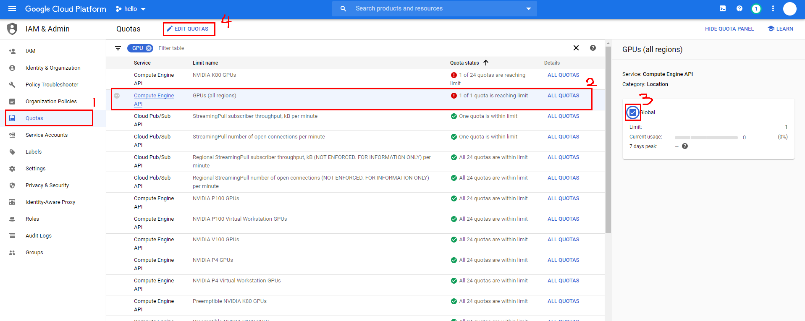

    1. Request GPU quota increase.

        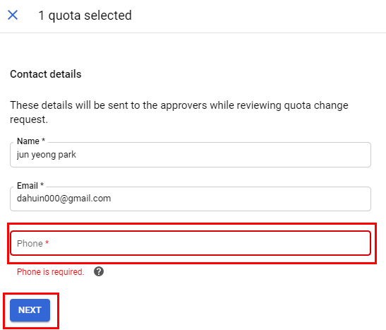

        

    1. Wait a few minutes and you will receive the email below.

        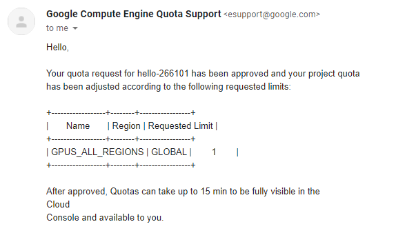

1. **Input fields and click Create Button.**

    * `instance name`: Name of your a notebook.
    * `machine type`: Performance of a computer to use as a notebook. You can check price at https://cloud.google.com/compute/all-pricing.
    * `GPU type`: GPU used on notebook. You can check GPU price at https://cloud.google.com/compute/all-pricing.
    * `Boot disk size in GB`: Storage of stats of notebook. You can check price at https://cloud.google.com/storage/pricing?hl=id.

    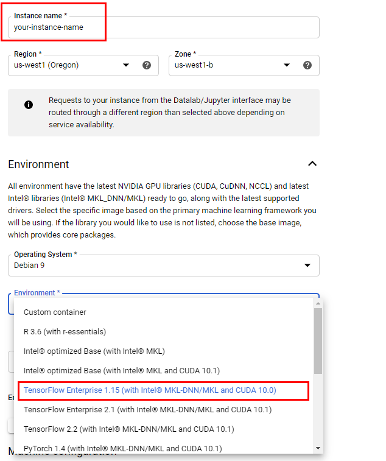

    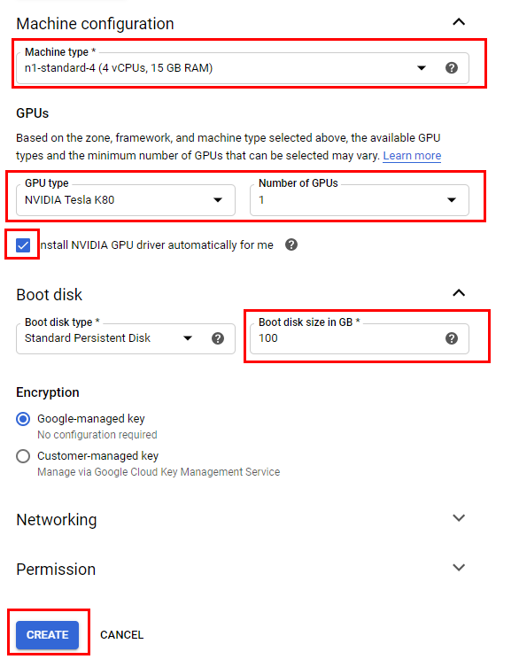


1. **(Reference) If your machine learning code is Tensorflow 1, but jupyter notebook environment is Tensorflow 2, You might get an error like this.**

    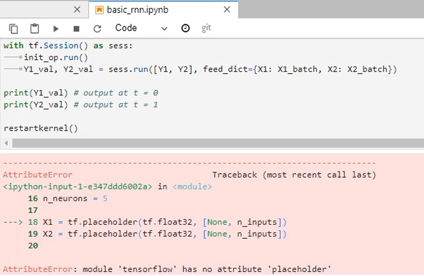

1. **Open Jupyterlab.**

    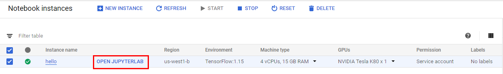

1. **Upload your code. If you want to upload a folder, zip it up and upload it. You can also use git.**

    1. Drag your zip file to notebook.

        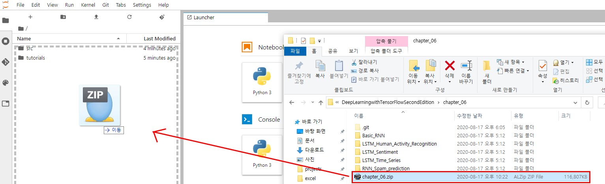

    1. Click `Terminal` on Launcher.
     
        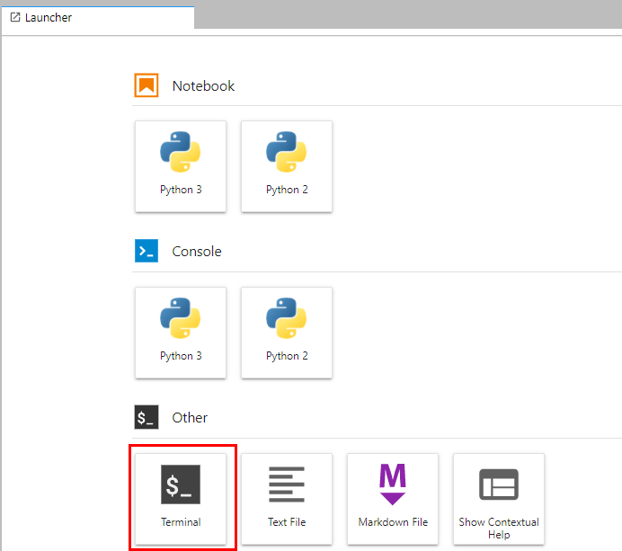
    

    1. Input command below.

        ```bash
        unzip your_zip_code.zip -d ./sample
        ```

        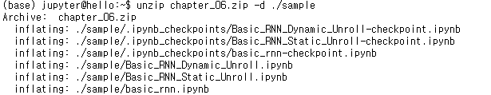

    1. Check your sample directory.

        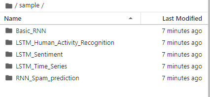

1. **Complete! Run your code.**

    ```
    PERFORMANCE ON TEST SET: Batch Loss = 0.8790364861488342, Accuracy = 0.8839497566223145
    Training iter #390000:   Batch Loss = 0.653466, Accuracy = 0.9273333549499512
    PERFORMANCE ON TEST SET: Batch Loss = 1.1527005434036255, Accuracy = 0.8177807927131653
    Training iter #420000:   Batch Loss = 0.595334, Accuracy = 0.9446666836738586
    PERFORMANCE ON TEST SET: Batch Loss = 0.926128625869751, Accuracy = 0.8466236591339111
    Training iter #450000:   Batch Loss = 0.568660, Accuracy = 0.9466666579246521
    PERFORMANCE ON TEST SET: Batch Loss = 0.8350828886032104, Accuracy = 0.8778418898582458
    Training iter #480000:   Batch Loss = 0.649660, Accuracy = 0.9066666960716248
    PERFORMANCE ON TEST SET: Batch Loss = 0.8104058504104614, Accuracy = 0.8849677443504333
    ```

1. **If you don't want to keep paying for your computer, you should `STOP` your notebook when not in use.**

    * Even if restart, The files will be kept.
    * If you don't want to pay for storage, click the `DELETE` button.

    1. When not in use..

        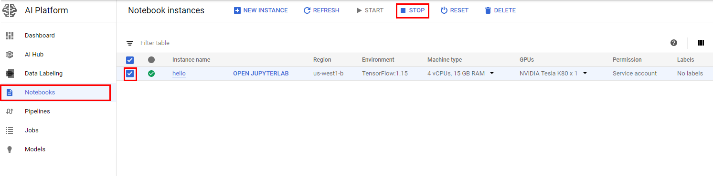

    1. When in use..

        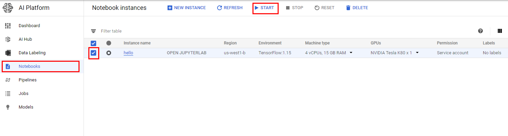

10. Tutorial is over 😀
